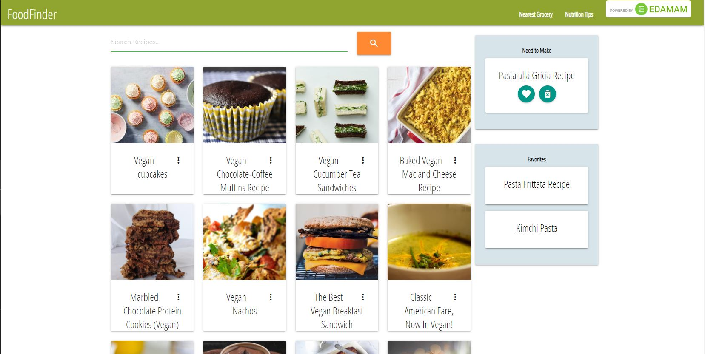
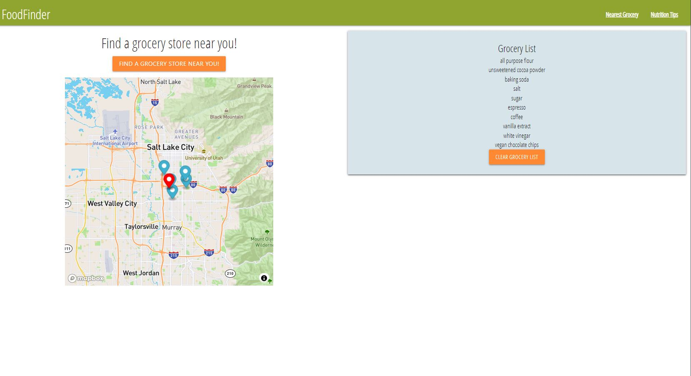

# recipeApplication

## Description

Application for searching recipes, generating a grocery list, and finding nearest grocery store.

## Acceptance Criteria
WHEN I load the page,
THEN I see a page that displays a search bar for recipes and two cards for “Need To Make” and “Favorites”.
WHEN I specify recipe criteria,
THEN I am presented with popular recipes that fits the search criteria.
WHEN I see a recipe that I want to try, 
THEN I can click on it to reveal the recipe, link to recipe URL, Groceries button and “Need to Make” button.
WHEN I select the Groceries button,
THEN I can generate a grocery list with the ingredients I need on the “Nearest Grocery” page.
WHEN I select the “Need To Make” button, 
THEN the recipe title is added to the “Need to Make” list and saved to LocalStorage.
WHEN I have made a recipe, 
THEN I can add it to the “Favorites” list and save it to LocalStorage.
WHEN I search my current location in the “Nearest Grocery” page, 
THEN a map shows grocery stores near me.

## Deployed Application
The deployed application can be found at this URL: https://mhowitz.github.io/recipeApplication/
The GitHub group repository can be found at this URL:	https://github.com/mhowitz/recipeApplication

## Installation

Click the github URL link to view the website. To view the code, click the link to the github repository. Download the repository to your computer and unzip the file. Open the index.html file to view the HTML code. Open the style.css file to view the style sheet. Open the script.js file to view the JavaScript code.

## Usage 
When the application is deployed, this page is shown:

The user may search recipes by ingredient or other options like 'vegan' or 'gluten free' to find recipes that they want to try. The application will display up to 20 recipes that match the search criteria. The user can click on each recipe card and the application will display the ingredients and 3 different buttons. The first link takes the user to the website of that recipe, then there are two buttons where the user can add the ingredients to that recipe to their grocery list that saves to local storage. The second button will add the recipe to a "Need To Make" list that saves to local storage so the user can revisit that recipe when they want to make it. Once the recipe is in the 'Need To Make' list, the user can add it to their favorites list or delete it from the list if they did not like that recipe.

Once the user adds different ingredients from recipes they want to try, the user can visit the "Nearest Grocery" page and this page is displayed

The user can click on the button that says "Find A Grocery Store Near You!", and the application will use the user's current location to find the 5 closest grocery stores to the user. There are markers displayed on the map for the user's current locaiton, and the 5 closest grocery stores. When the user clicks on one of the markers, a pop up is displayed that shows the name of the grocery stores and their addresses. The grocery list that was gernerated by the user clicking on a recipe is displayed on the right. The grocery list does not allow duplicates or items like 'water'. Once the user has gone grocery shopping, the user may clear their grocery list with the button at the bottom of the list.

## Sources

Edamam API
Mapbox API
Materialize CSS

## License
MIT License

Copyright (c) 2021 Mikayla Howitz, Allana Leerskov, Chelsea Holmstead and Sara Barnett

Permission is hereby granted, free of charge, to any person obtaining a copy of this software and associated documentation files (the "Software"), to deal in the Software without restriction, including without limitation the rights to use, copy, modify, merge, publish, distribute, sublicense, and/or sell copies of the Software, and to permit persons to whom the Software is furnished to do so, subject to the following conditions:

The above copyright notice and this permission notice shall be included in all copies or substantial portions of the Software.

THE SOFTWARE IS PROVIDED "AS IS", WITHOUT WARRANTY OF ANY KIND, EXPRESS OR IMPLIED, INCLUDING BUT NOT LIMITED TO THE WARRANTIES OF MERCHANTABILITY, FITNESS FOR A PARTICULAR PURPOSE AND NONINFRINGEMENT. IN NO EVENT SHALL THE AUTHORS OR COPYRIGHT HOLDERS BE LIABLE FOR ANY CLAIM, DAMAGES OR OTHER LIABILITY, WHETHER IN AN ACTION OF CONTRACT, TORT OR OTHERWISE, ARISING FROM, OUT OF OR IN CONNECTION WITH THE SOFTWARE OR THE USE OR OTHER DEALINGS IN THE SOFTWARE.
